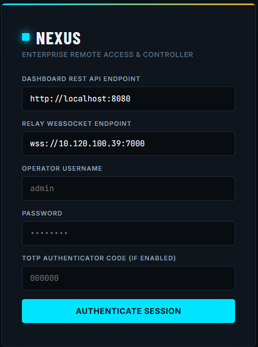
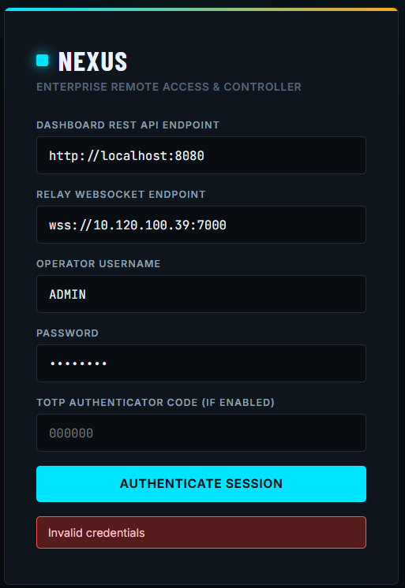
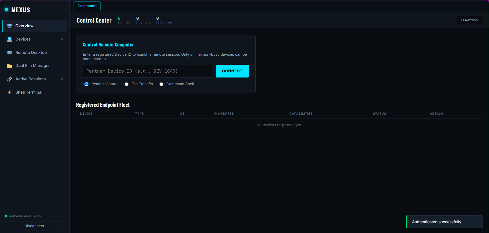
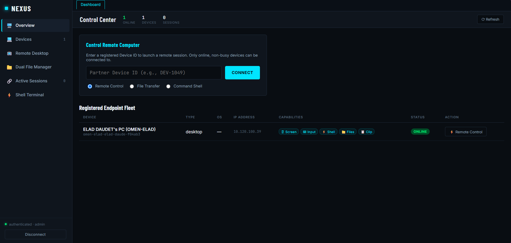
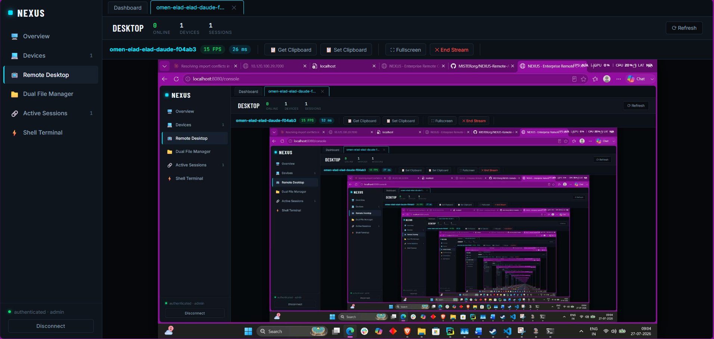
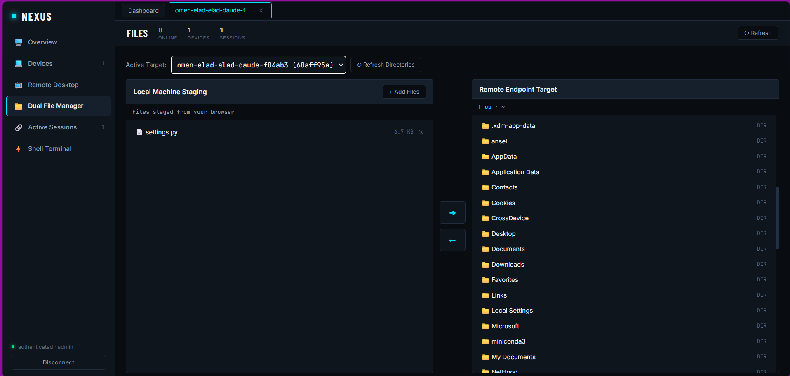
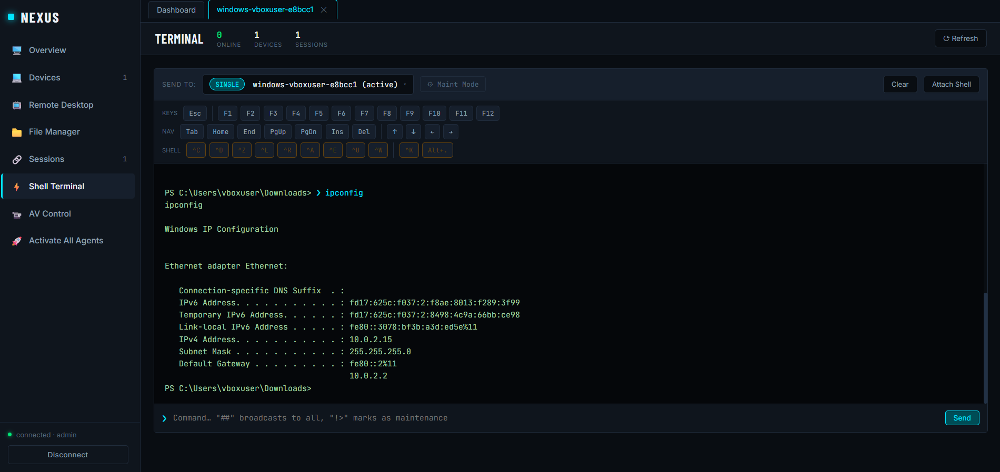

# NEXUS

**Enterprise Remote Access & Controller**

NEXUS is a self-hosted remote access platform that lets operators securely control, monitor, and manage endpoint devices over a relay. It combines a WebSocket-based control plane, a FastAPI operator dashboard, and lightweight device agents into a single, modular system.

---

## Demonstration

A complete walkthrough of authentication, device registration, remote desktop, file transfer, and terminal access is available in the project video:

**## 🎥 Demo Video

[](https://youtu.be/SgZZgWiHcBY)
** 
— general demonstration and explanation of the platform.


---

## Quick Start

```bash
pip install -r requirements.txt

# Terminal 1 — Relay (WebSocket hub)
python -m core.relay --host 0.0.0.0 --port 7000

# Terminal 2 — Dashboard (REST API + operator console)
uvicorn ui.dashboard:app --host 0.0.0.0 --port 8080 --reload
```

Open `http://localhost:8080`, authenticate, and connect agents with the generated connector.

For one-click setup (relay + dashboard + optional public tunnel):

```bash
python setup_and_launch.py
```

---

## Operator Console

### Authentication

Operators authenticate against the dashboard with username, password, and optional TOTP.



Invalid credentials are rejected immediately with a clear error.



On success the session is established and the Control Center loads.



---

### Device Fleet & Overview

Once agents connect, they appear in the **Registered Endpoint Fleet** with status, capabilities, and one-click actions.



Key controls available from the overview:

| Control            | Description                                      |
|--------------------|--------------------------------------------------|
| Remote Control     | Full interactive desktop session                 |
| File Transfer      | Bidirectional dual-pane file manager             |
| Command Shell      | Interactive PowerShell / shell terminal          |
| Screen / Input / Clip | Capability badges shown per device            |

---

### Remote Desktop

Launch a live remote desktop session to any online, non-busy endpoint. The stream supports:

- Real-time screen capture with adaptive quality
- Keyboard & mouse input (with capture toggle)
- Clipboard pull / push
- Full-screen mode



---

### Dual File Manager

Transfer files between the operator’s browser and the remote endpoint through a dual-pane interface. Stage files locally, then push or pull with a single action.



---

### Shell Terminal

Open an interactive shell on the remote device. Commands are executed in real time and output is streamed back to the console.



---

### Camera & Audio

- Live camera list (dynamically detected), stream, and full-quality snapshot
- Mic capture + speaker playback
- Browser-side recording of the live view
- AI frame-processor hook ready for custom models (runs on the agent)

---

## Architecture

The codebase is organized so each capability lives in exactly one place, with a clear contract for how it plugs into the rest of the system.

```
nexus/
├── config/                # Shared settings (env > .env > defaults.yaml)
│   ├── settings.py        #   Pydantic Settings
│   └── defaults.yaml
│
├── core/                  # Server-side domain logic (relay process)
│   ├── auth.py            #   Users, JWT, RBAC
│   ├── registry.py        #   Device directory
│   ├── session.py         #   Session lifecycle & message routing
│   └── relay.py           #   WebSocket hub
│
├── transport/             # Network layer
│   ├── websocket_transport.py  # Primary: WSServer / WSClient / ConnectionPool
│   ├── tls_context.py          # Shared TLSContextFactory (mTLS-aware)
│   ├── tcp_transport.py        # Fallback / P2P
│   ├── tunnel.py               # NAT traversal (ReverseTunnel / SSHTunnel)
│   └── hole_punch.py           # STUN-lite rendezvous + UDP hole-punch
│
├── agents/                # Device-side feature implementations
│   ├── base_agent.py      # Abstract agent contract
│   ├── desktop_agent.py   # Screen, input, clipboard
│   ├── server_agent.py    # Terminal + files (headless)
│   ├── camera.py          # Camera list / stream / snapshot + AI hook
│   ├── audio.py           # Mic + speaker
│   ├── av_handler.py      # Composition of camera + audio
│   └── adaptive_quality.py # AIMD quality controller for streams
│
├── utils/                 # Crypto, logging, heartbeat, rate limiting
│   ├── crypto.py
│   ├── logger.py
│   ├── heartbeat.py
│   └── ratelimit.py
│
├── ui/                    # Operator dashboard
│   ├── dashboard.py       # FastAPI app
│   └── static/
│       ├── dashboard.html
│       ├── dashboard.css
│       └── js/            # One JS file per feature
│
├── connect_remote.py      # Zero-touch agent connector
├── nexus_agent_entry.py   # PyInstaller agent entrypoint
├── setup_and_launch.py    # One-click launcher + public tunnel
├── build_standalone.py    # Build both .exe targets
└── requirements.txt
```

### Feature boundary

Every remote-control capability is defined once in `core/session.py` (`MessageType`) and implemented independently on each side:

| Feature    | Agent side                          | Controller side (browser) |
|------------|-------------------------------------|---------------------------|
| Screen     | `desktop_agent.py`                  | `remote_desktop.js`       |
| Input      | `desktop_agent.py`                  | `remote_desktop.js`       |
| Camera     | `camera.py`                         | `av_control.js`           |
| Audio      | `audio.py`                          | `av_control.js`           |
| Terminal   | `server_agent.py` / `desktop_agent` | `terminal.js`             |
| Files      | `server_agent.py` / `desktop_agent` | `file_manager.js`         |
| Clipboard  | `desktop_agent.py`                  | `clipboard.js`            |

To add a new feature (e.g. remote print):

1. Add the message type in `core/session.py`.
2. Map the required RBAC permission.
3. Implement the `on_*` hook on the appropriate agent(s).
4. Add a corresponding JS module and script tag in the dashboard.

No other files need to change.

### Agent contract

`BaseAgent` owns connection, reconnect, heartbeat, and auth. Feature hooks (`on_screen_request`, `on_mouse_event`, `on_key_event`, terminal, files, clipboard, camera, audio) default to no-ops. New device types only override what they support.

`AVHandlerMixin` composes `CameraMixin` + `AudioMixin` and is mixed into `DesktopAgent` so camera/audio can be developed and tested in isolation.

### Adaptive quality streaming

`AdaptiveQualityController` (AIMD) independently adjusts JPEG quality, scale, and FPS for screen and camera streams based on:

- **RTT** (via `NET_PROBE` / `NET_PROBE_ACK`)
- **Capture-loop lag**

Downgrades fast (2 consecutive bad ticks), recovers slowly (6 consecutive good ticks). Quality is scaled relative to the operator’s configured baseline.

### P2P endpoint discovery

`transport/hole_punch.py` provides a STUN-lite UDP rendezvous server (started by the relay). After session handshake, agents discover their public endpoint and report it via `P2P_ENDPOINT_OFFER`. Full UDP hole-punch is implemented and tested; it is ready for native/CLI controllers or a future WebRTC path (browsers cannot open raw UDP sockets).

---

## Key Capabilities

- **Relay & Session management** — authenticated WebSocket hub with JWT, RBAC, and clean session teardown.
- **Adaptive quality streaming** — screen and camera streams adjust quality based on RTT and capture-loop lag (AIMD).
- **P2P endpoint discovery** — STUN-lite rendezvous for future direct paths (WebRTC-ready foundation).
- **Camera & Audio** — live device list, stream, full-quality snapshot, browser-side recording; AI frame-processor extension point.
- **File transfer** — dual-pane manager with staging from the operator browser.
- **Interactive shell** — real-time command execution with special-key support.
- **TLS / mTLS** — shared TLS context factory; optional client certificates.
- **NAT traversal helpers** — reverse tunnels, optional UPnP, and public tunnel support via `setup_and_launch.py`.
- **Standalone builds** — PyInstaller scripts for both the agent connector and full agent binary.

---

## Configuration

Settings are loaded in priority order:

1. Environment variables  
2. `.env` file  
3. `config/defaults.yaml`

Common entries include relay host/port, dashboard port, TLS certificates, feature flags, and quality baselines.

---

## Building Standalone Binaries

```bash
python build_standalone.py
```

Produces the zero-touch connector (`connect_remote` / `.exe`) and the full agent binary. Runtime hooks ensure OpenSSL and DLL search paths are correct on Windows.

---

## WAN / Public Access

`setup_and_launch.py` can automatically:

- Start the relay and dashboard
- Attempt UPnP port mapping
- Open a public reverse tunnel (recommended for CGNAT / residential ISPs)
- Verify the tunnel is reachable before presenting the URL

The tunnel is the most reliable path for most home networks. Direct WAN exposure remains available for advanced setups with proper port forwarding.

> **Note:** Free anonymous tunnels typically receive a new random subdomain on every restart. For a permanent address, use a named tunnel (Cloudflare Tunnel, paid pinggy, etc.) or host the relay on a VPS with a stable domain.

---

## Security Notes

- Passwords are hashed; sessions use JWT + optional TOTP.
- All control traffic is encrypted (AES-GCM / ECDH where applicable).
- Rate limiting and structured security audit logging are built in.
- The platform is designed for **authorized remote administration**. Deploy only on systems you own or have explicit permission to manage.

---

## License & Contribution

This is a private / internal project structure. Adapt licensing and contribution guidelines to your organization’s requirements.

---

*NEXUS — Enterprise Remote Access & Controller*
